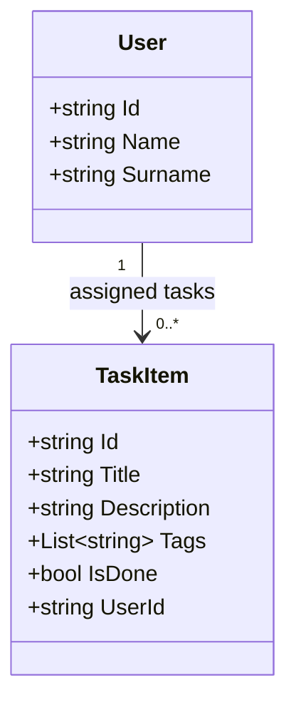
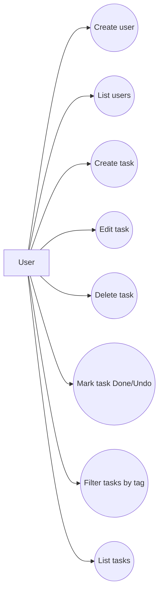

# Diagrams

This file contains draft diagrams for project documentation.

## Class diagram (draft)

## Use case diagram (draft)

> Note: These are documentation-ready drafts and can be exported to images for the final report.
